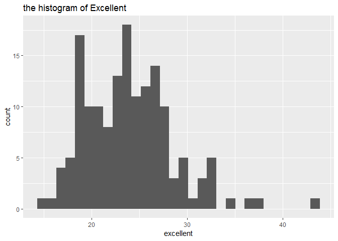
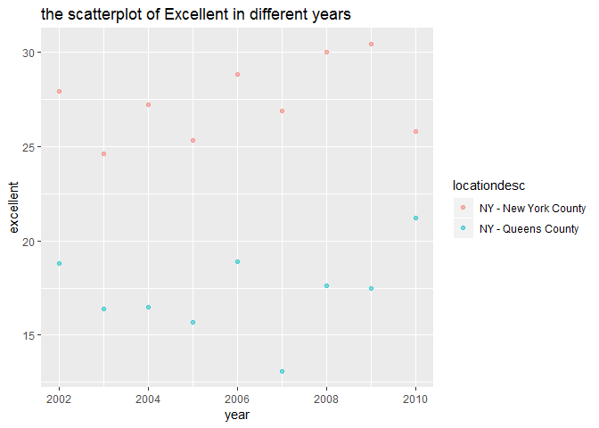

p8105\_hw2\_cy2522
================
Chu YU
30th-Sep-2018

problem 1
=========

import and clean the data
-------------------------

``` r
# import the csv data
library(tidyverse)
```

    ## -- Attaching packages --------------------------------------------------- tidyverse 1.2.1 --

    ## √ ggplot2 3.0.0     √ purrr   0.2.5
    ## √ tibble  1.4.2     √ dplyr   0.7.6
    ## √ tidyr   0.8.1     √ stringr 1.3.1
    ## √ readr   1.1.1     √ forcats 0.3.0

    ## -- Conflicts ------------------------------------------------------ tidyverse_conflicts() --
    ## x dplyr::filter() masks stats::filter()
    ## x dplyr::lag()    masks stats::lag()

``` r
transit_df = 
  read.csv("./data/NYC_Transit_Subway_Entrance_And_Exit_Data.csv") %>%
  janitor::clean_names()

# clean the data
transit_tidy_df = 
  select( transit_df, line:entry, vending, entrance_type, ada) %>%
  mutate(entry = ifelse(entry == "YES", TRUE, FALSE))

# dimension
dim(transit_tidy_df)
```

    ## [1] 1868   19

-   This dataset contains : `line, station_name, station_latitude, station_longitude, route_num , route , entry, vending, entrance_type, ada.`
-   My data cleaning includes three steps: cleaning variables' names, converting the entry variable from character (YES vs NO) to a "True" and "False", and deleting the unnecessary columns.
-   The **dimension** of the dataset : 1868\*19.
-   They are not tidy.There are different routes in key variables which I think should be added as the values and there are also many missing values.

distinct
--------

``` r
# How many distinct stations?
sn_dis = 
  distinct(transit_tidy_df[c("station_name","line" ,"ada")]) 
nrow(sn_dis)
```

    ## [1] 465

``` r
# How many stations with ada:
filter(sn_dis, ada == "TRUE") %>% nrow()
```

    ## [1] 84

``` r
# prop of vending
transit_vending = filter(transit_df, vending == "NO")
prop.table(table(transit_vending$entry))
```

    ## 
    ##        NO       YES 
    ## 0.6229508 0.3770492

-   There are 465 distinct stations.
-   There are 84 stations with ADA compliance.
-   The proportion of station entrances / exits without vending allow entrance is approximately 0.38

Reformat
--------

``` r
# gather the route columns
transit_tidy_df_rt = 
  gather(transit_tidy_df, key = route_num, value = route, route1:route11)
```

    ## Warning: attributes are not identical across measure variables;
    ## they will be dropped

``` r
# how many stations serving A ?
filter(transit_tidy_df_rt, route == "A") %>% 
  distinct(station_name,line) %>%
  nrow()
```

    ## [1] 60

``` r
# serving A as well as ADA compliance
filter(transit_tidy_df_rt, route == "A" & ada == "TRUE") %>% 
  distinct(station_name,line) %>%
  nrow()
```

    ## [1] 17

-   There are 60 stations serving train A.
-   There are 17 stations sering A that has ADA compliance.

Problem 2
=========

``` r
# import and clean the data
library(readxl)
trash_df = 
  readxl::read_excel("./data/HealthyHarborWaterWheelTotals2018-7-28.xlsx", 
                    range = "A2:N338", sheet = 1) %>%
  janitor::clean_names() %>%
  filter(!is.na(dumpster)) %>%
  mutate(sports_balls = round(sports_balls, digits = 0)) 

# Read and clean precipitation data for 2016 and 2017
trash_df_2017 = 
  readxl::read_xlsx("./data/HealthyHarborWaterWheelTotals2018-7-28.xlsx", 
                    range = "A2:B14", sheet = 4) %>%
  janitor::clean_names() %>%
  filter(!is.na(total)) %>%
  mutate(year = "2017")

trash_df_2016 = 
  readxl::read_xlsx("./data/HealthyHarborWaterWheelTotals2018-7-28.xlsx", 
                    range = "A2:B14", sheet = 5) %>%
  janitor::clean_names() %>%
  filter(!is.na(total)) %>%
  mutate(year = "2016")

# combine datasets and convert months
trash_bd = rbind(trash_df_2016, trash_df_2017) %>%
  mutate(month = month.name[month])

dim(trash_df)
```

    ## [1] 285  14

``` r
dim(trash_bd)
```

    ## [1] 24  3

``` r
sum(trash_df_2017$total)
```

    ## [1] 32.93

``` r
trash_med = filter(trash_df ,year == "2016") 
  median(trash_med$sports_balls)
```

    ## [1] 26

-   From the three different sheets, we can see the dimension of **trash\_df** is 285,14, that of **trash\_bd** is 24, 3. there are variables like `year, month, total`in trash\_bd, or variables like`sports_balls, weight_tons`in trash\_df.
-   The total precipitaion in 2017 is 32.93.
-   The median number of sports balls in a dumpster in 2016 is 26.

Problem 3
=========

``` r
library(p8105.datasets)

data("brfss_smart2010")

brfss = janitor::clean_names(brfss_smart2010) %>% 
  filter(topic == "Overall Health") %>%
  select(year, locationabbr, locationdesc, response, data_value) %>%
  spread(key = response, value = data_value) %>%
  janitor::clean_names() %>%
  mutate(exl_gd_prop = excellent + very_good )
```

-   import and clean the data: filter the topic first and then select useful variables, spread the response variable, clean the names of the variables, and finally add a new variable named `exl_gd_prop`.

the questions
-------------

``` r
# unique locations
nrow(distinct(brfss,locationdesc))
```

    ## [1] 404

``` r
nrow(distinct(brfss,locationabbr))
```

    ## [1] 51

``` r
## there are 51 states here. Every states have been represented.
names(table(brfss$locationabbr))[which.max(table(brfss$locationabbr))]
```

    ## [1] "NJ"

``` r
## we can know that "NJ" is observed most.
```

-   There are 404 unique locations included. Because there are 51 states here. So every state has been represented. Among all the states, `NJ` is observed most.

``` r
# get the median
brfss_2002 = filter(brfss, year == "2002") 
median(brfss_2002$excellent, na.rm = T)
```

    ## [1] 23.6

-   The median of `Excellent` response value is 23.6

make a histogram
----------------

``` r
ggplot(brfss_2002, aes(x = excellent)) + 
  geom_histogram() + ggtitle( "the histogram of Excellent") +
  ggsave("hist_Exl_2002.jpg",width = 8, height = 5)
```

    ## `stat_bin()` using `bins = 30`. Pick better value with `binwidth`.

    ## Warning: Removed 2 rows containing non-finite values (stat_bin).

    ## `stat_bin()` using `bins = 30`. Pick better value with `binwidth`.

    ## Warning: Removed 2 rows containing non-finite values (stat_bin).

 - The histogram above is the plot presenting “Excellent” response values in the year 2002. X represents the proportion of `Excellent`, and Y represents the amount of Excelent responces in 2002. We can see form the plot that most excellent response appear from proportion of 20 to 28. \#\# Make a scatterplot

``` r
# 
brfss %>% 
  filter( locationdesc == "NY - New York County"|locationdesc == "NY - Queens County") %>%
  ggplot(aes(x = year, y = excellent, color = locationdesc)) + 
  geom_point(alpha = .5, position = "dodge") +
  ggtitle( "the scatterplot of Excellent in different years") + 
  ggsave("points_Exl_yr.jpg",width = 8, height = 5)
```

    ## Warning: Width not defined. Set with `position_dodge(width = ?)`

    ## Warning: Width not defined. Set with `position_dodge(width = ?)`



-   It can be seen from the plot that New York County gets more Excellent response than Queen County.
